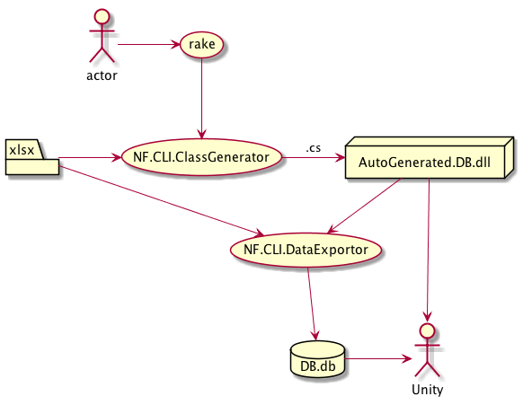

# NF.BaseDataFlow


[flow.puml](flow.puml)

## introduce
this is sample dataflow. When I making a game(in unity), I don't like to hard-coding for data class from excel. I'm writing custom class generator, and data exporter for that work.

If you want to use [ScriptableObject](https://docs.unity3d.com/ScriptReference/ScriptableObject.html), check [Unity-QuickSheet](https://github.com/kimsama/Unity-QuickSheet).

## basic Knowledge.
* [Rakefile](https://github.com/ruby/rake)
* [dotnet cli](https://www.microsoft.com/net/core)
* [Sqlite](https://www.sqlite.org/) && [Sqlcipher](https://www.zetetic.net/sqlcipher/)

## example
```
$ rake --version
rake, version 11.1.2
$ dotnet --version # because on macOs doesn't support latest version of dotnet cli not yet.
1.0.0-preview2-1-003177
$ rake
 ...
$ tree __BUILD
__BUILD
├── AutoGenerated.DB.dll
├── AutoGenerated.DB.pdb
├── DB.db
├── SQLite.Attribute.dll
└── SQLite.Attribute.pdb
```

## TODO
- [ ] refactoring
- [ ] mustach to dotliquid
- [ ] serializable contructor for custom value.
- [ ] documentation


[atom-ext:plantuml-viewer]: https://atom.io/packages/plantuml-viewer
[chrome-ext:PlantUML Viewer]: https://chrome.google.com/webstore/detail/plantuml-viewer/legbfeljfbjgfifnkmpoajgpgejojooj
[sqlitebrowser]: https://github.com/sqlitebrowser/sqlitebrowser
